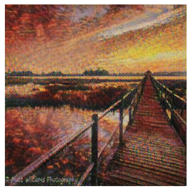

# Cycle Gan

Data and idea source: 
 <a href = 'https://www.kaggle.com/competitions/gan-getting-started/leaderboard'> Kaggle competition  </a>

# Introducing 

I used this <a href ='https://www.kaggle.com/code/amyjang/monet-cyclegan-tutorial/notebook#Create-submission-file'> notebook </a> as entry point to world of tensorflow and CycleGans.
This noteebok used UNET architecture for generator. My challenge is build something different by myself. 
After researches I choosed the ResNet arch. 

# Training 

See the notebook named <a href = 'CycleGan_KERAS.ipynb'> CycleGan_KERAS</a>. 

All trainig steps described here with hyperparametrs as well. 

# Overview

### Example real image 

### Example monet adaptation

